# 001-Connect: Flow & Architecture Diagrams

Comprehensive flow diagrams showing the functional execution paths, data flow, and HTTP routes for the Wi-Fi provisioning service.

## 1. Functional Flow & Execution Paths

Complete execution flow from Pi boot through provisioning to either successful connection or retry loop.

**Entry Point**: `src/weatherbox/provisioning/boot.py::main()`

```mermaid
graph TD
    A["📍 ENTRY: Pi Boot<br/>src/weatherbox/provisioning/boot.py::main()"] --> B["Load config<br/>config/loader.py::ConfigLoader<br/>→ /etc/weatherbox/config.yaml"]
    
    B --> C["Load stored credentials<br/>credentials/store.py::CredentialStore<br/>→ /etc/weatherbox/credentials.yaml"]
    
    C --> D{Credentials Found?}
    
    D -->|YES| E["WiFi Adapter: Connect<br/>wifi/adapter.py::WiFiAdapter<br/>.connect_network()"]
    D -->|NO| H["🔴 No Credentials"]
    
    E --> F{Connection Successful?}
    F -->|YES| G["✅ DONE: Weatherbox running<br/>services/display_service.py<br/>Exit provisioning"]
    F -->|NO: Max Attempts| H
    
    H --> I["🔵 START PROVISIONING MODE"]
    I --> J["1. Start AP Hotspot<br/>wifi/adapter.py::WiFiAdapter<br/>.start_hotspot()"]
    
    J --> K["2. Start Flask App<br/>provisioning/app.py::ProvisioningApp<br/>.run()"]
    
    K --> L["🌐 HTTP API Ready:<br/>GET / → Captive Portal UI"]
    
    L --> M["User Device:<br/>Connects to hotspot<br/>Opens browser"]
    
    M --> N{HTTP Route}
    
    N -->|GET /| O["Serve provisioning<br/>portal HTML<br/>app.py::render_template"]
    
    N -->|GET /api/networks| P["Scan WiFi Networks<br/>WiFiAdapter.scan()<br/>Return JSON list"]
    
    N -->|POST /api/connect| Q["Extract credentials<br/>from request JSON<br/>SSID, password"]
    
    Q --> R["Validate credentials<br/>Check SSID format<br/>Check password length"]
    
    R --> S{Valid?}
    S -->|NO| T["Return error JSON<br/>Response: 400"]
    T --> U["Client retry:<br/>Show error message"]
    U --> N
    
    S -->|YES| V["Save credentials<br/>CredentialStore<br/>→ /etc/weatherbox/credentials.yaml<br/>chmod 0o600"]
    
    V --> W["Restart WiFi Service<br/>WiFiAdapter<br/>.disconnect_hotspot()"]
    
    W --> X["Attempt connection<br/>WiFiAdapter<br/>.connect_network()"]
    
    X --> Y{Connected?}
    
    Y -->|YES| Z["🎉 Success Response<br/>Return JSON:<br/>{ 'status': 'connected' }"]
    
    Y -->|NO| AA["⚠️ Connection Failed<br/>Return error<br/>Show on UI"]
    
    Z --> AB["Client: Redirect<br/>Close portal<br/>Show success screen"]
    
    AA --> AC["Restart hotspot<br/>User can retry<br/>Go back to: N"]
    
    AB --> AD["✅ PROVISIONED<br/>Exit provision mode<br/>WiFi connected"]
    AD --> AE["Load main services<br/>001-connect finished<br/>002-display starts"]
    
    style A fill:#90EE90
    style G fill:#98FB98
    style I fill:#87CEEB
    style Z fill:#98FB98
    style AD fill:#98FB98
    style AE fill:#FFB6C1
```



### Execution Paths Summary

| Path | Condition | Outcome |
|------|-----------|---------|
| **Happy Path** | Credentials exist + connection succeeds | ✅ Exit provisioning (5 seconds) |
| **First Boot** | No credentials | 🔵 Start hotspot + portal (user configures) |
| **Connection Failure** | Attempt fails, retries exhausted | 🔴 Restart hotspot (user can retry) |
| **Portal Validation Fail** | User submits invalid SSID/password | ⚠️ Show error, user retry (stay in loop) |
| **Portal Success** | User provides valid credentials + connects | 🎉 Save credentials, exit provisioning |

---

## 2. Data Flow & Storage

Shows how credentials and configuration data move through the system, from user input to persistent storage.


### Data References

| Data | Source | Usage | Lifetime |
|------|--------|-------|----------|
| **config.yaml** | System admin | AP SSID, mode, timeouts | Persistent (system config) |
| **credentials.yaml** | User (portal) | WiFi SSID + password | Persistent (survives reboot) |
| **Portal form data** | User browser | SSID + password input | Request lifecycle only |
| **NetworkManager state** | Kernel/hostapd | WiFi connection status | Live (until disconnected) |

---

## 3. HTTP Routes & Portal Lifecycle

Detailed view of the Flask API endpoints, request/response flows, and portal user interactions.

```mermaid
graph TD
    A["🌐 HTTP Routes<br/>(provisioning/app.py)"] --> B["GET /"]
    A --> C["GET /api/networks"]
    A --> D["POST /api/connect"]
    A --> E["GET /captive-endpoint<br/>(iOS redirect)"]
    
    B -->|Flask render_template| F["Serve HTML<br/>templates/portal.html<br/>- Network list dropdown<br/>- Password input<br/>- Connect button<br/>- Status display"]
    
    F -->|JavaScript: fetch| G["User clicks 'Connect'"]
    
    C -->|WiFiAdapter.scan()| H["Return JSON<br/>Available networks:<br/>[<br/>  'HOME_NETWORK',<br/>  'GUEST_WIFI',<br/>  'OFFICE'<br/>]"]
    
    G -->|POST SSID + pwd| D
    
    D -->|Validation layer| I{"SSID format?<br/>Password len?"}
    
    I -->|Invalid| J["Return: 400 Bad Request<br/>{<br/>  'error': 'Invalid format'<br/>}"]
    
    J -->|Display on UI| K["Show error message<br/>User can retry"]
    
    I -->|Valid| L["Try connect<br/>WiFiAdapter<br/>.connect_network()"]
    
    L -->|5 second timeout| M{Network appeared?}
    
    M -->|YES| N["Save credentials<br/>CredentialStore<br/>.save_credentials()"]
    
    M -->|NO| O["Return: 503 Service Unavailable<br/>{<br/>  'error': 'Connection failed'<br/>}"]
    
    O -->|Display on UI| P["Show error + retry button"]
    
    N -->|Restart WiFi| Q["Disconnect hotspot<br/>Stop dnsmasq<br/>Stop hostapd"]
    
    Q -->|Connect to real SSID| R["WiFiAdapter<br/>.connect_network()"]
    
    R -->|Return success JSON| S["Return: 200 OK<br/>{<br/>  'status': 'connected',<br/>  'network': 'HOME_NETWORK'<br/>}"]
    
    S -->|JavaScript handler| T["🎉 Success:<br/>- Hide portal<br/>- Show checkmark<br/>- Display 'Ready!'"]
    
    E -->|Redirect from iOS<br/>Captive portal detection| F
    
    style A fill:#87CEEB
    style B fill:#FFE4B5
    style C fill:#FFE4B5
    style D fill:#FFE4B5
    style S fill:#90EE90
    style T fill:#90EE90
    style J fill:#FFB6C1
    style O fill:#FFB6C1
```

### Route Details

| Route | Method | Request | Response | Purpose |
|-------|--------|---------|----------|---------|
| `/` | GET | None | HTML portal page | Serve UI to user |
| `/api/networks` | GET | None | `[ { ssid, signal_strength } ]` | Get available WiFi networks |
| `/api/connect` | POST | `{ ssid, password }` | `{ status, error, network }` | Attempt connection + save creds |
| `/captive-endpoint` | GET | None | Redirect to `/` | Handle iOS captive portal detection |

### Request/Response Examples

**GET /api/networks Response:**
```json
[
  { "ssid": "HOME_NETWORK", "signal_strength": -45 },
  { "ssid": "GUEST_WIFI", "signal_strength": -67 },
  { "ssid": "OFFICE", "signal_strength": -72 }
]
```

**POST /api/connect Request:**
```json
{
  "ssid": "HOME_NETWORK",
  "password": "secret123"
}
```

**POST /api/connect Response (Success):**
```json
{
  "status": "connected",
  "network": "HOME_NETWORK"
}
```

**POST /api/connect Response (Validation Error):**
```json
{
  "error": "Invalid SSID format",
  "status": "validation_failed"
}
```

**POST /api/connect Response (Connection Failed):**
```json
{
  "error": "Connection failed (timeout)",
  "status": "connection_failed"
}
```

---

## Key Entry Points & Module Functions

Quick reference for where code starts and what functions are called.

### Boot Entry Point
```
File: src/weatherbox/provisioning/boot.py
Entry: main()
  ├─ ConfigLoader().load()
  │   └─ Reads: /etc/weatherbox/config.yaml
  ├─ CredentialStore().load()
  │   └─ Reads: /etc/weatherbox/credentials.yaml
  ├─ WiFiAdapter.connect_network()  [if credentials exist]
  │   └─ Uses: NetworkManager (system level)
  └─ WiFiAdapter.start_hotspot()  [if no credentials or connection failed]
      ├─ Starts: dnsmasq, hostapd
      └─ Then: ProvisioningApp().run()  [Flask]
```

### Flask App Entry Point
```
File: src/weatherbox/provisioning/app.py
Entry: ProvisioningApp().run()
  ├─ Route: GET / 
  │   └─ render_template('portal.html')
  ├─ Route: GET /api/networks
  │   └─ WiFiAdapter.scan()
  ├─ Route: POST /api/connect
  │   ├─ Validation
  │   ├─ WiFiAdapter.connect_network()
  │   ├─ CredentialStore.save_credentials()
  │   └─ Return: JSON response
  └─ Route: GET /captive-endpoint
      └─ Redirect to /
```

### Module Interaction Flow

```
boot.py (orchestrator)
  ├─ Imports: ConfigLoader, CredentialStore, WiFiAdapter
  ├─ Calls: ConfigLoader.load()
  ├─ Calls: CredentialStore.load()
  ├─ Calls: WiFiAdapter.connect_network()
  │   └─ Uses: NetworkManager client
  └─ Calls: ProvisioningApp().run()
      ├─ Imports: Flask, WiFiAdapter, CredentialStore
      ├─ Routes to: WiFiAdapter.scan()
      ├─ Routes to: WiFiAdapter.connect_network()
      └─ Routes to: CredentialStore.save_credentials()
```

---

## File Storage

### Configuration Files

| File | Location | Permissions | Contents | When Written |
|------|----------|-------------|----------|--------------|
| `config.yaml` | `/etc/weatherbox/config.yaml` | 0o644 | AP SSID, mode, timeouts | System admin (install time) |
| `credentials.yaml` | `/etc/weatherbox/credentials.yaml` | 0o600 | WiFi SSID + password | Portal (user connects) |

### Code Files

| Module | File | Key Functions |
|--------|------|----------------|
| Boot | `src/weatherbox/provisioning/boot.py` | `main()` |
| Config | `src/weatherbox/config/loader.py` | `ConfigLoader.load()` |
| Credentials | `src/weatherbox/credentials/store.py` | `CredentialStore.load()`, `save()` |
| WiFi | `src/weatherbox/wifi/adapter.py` | `WiFiAdapter.connect_network()`, `start_hotspot()`, `scan()` |
| Portal | `src/weatherbox/provisioning/app.py` | `ProvisioningApp.run()`, route handlers |
| Templates | `src/weatherbox/provisioning/templates/portal.html` | HTML + JavaScript UI |

---

## Error Handling & Fallbacks

### Credential Load Failure
```
CredentialStore.load() fails
  → Assume first boot (no stored credentials)
  → Start provisioning mode
  → User configures via portal
```

### Connection Failure (Stored Credentials)
```
WiFiAdapter.connect_network() fails
  → Retry N times with backoff
  → All retries exhausted → start hotspot
  → User can reconfigure via portal
```

### Invalid Form Submit
```
User submits invalid SSID/password
  → Validation fails (400 Bad Request)
  → Portal shows error
  → User can correct and resubmit
  → No state change
```

### Portal to Network Connection Transition
```
User connects in portal
  → Credentials saved to /etc/weatherbox/credentials.yaml
  → Hotspot and dnsmasq stop
  → WiFiAdapter connects to target network
  → If success: exit provisioning, load display service
  → If failure: restart hotspot for user to retry
```

---

## Timing & Sequence

### First Boot (No Credentials)
```
1. boot.py starts (0ms)
2. CredentialStore.load() → no file found (50ms)
3. Start hotspot + Flask (2-3 seconds)
4. Portal loads (user clicks connect)
5. User enters SSID/password
6. POST /api/connect validation (100ms)
7. Connect attempt + timeout (5-10 seconds)
   - If success: save creds (100ms) → exit
   - If fail: show error → user can retry
Total (worst case): 10-15 seconds to portal ready
```

### Normal Boot (With Credentials)
```
1. boot.py starts (0ms)
2. CredentialStore.load() → read credentials (50ms)
3. WiFiAdapter.connect_network() → attempt connect (5-10 seconds)
   - If success: exit provisioning (5-10 seconds total)
   - If fail: start hotspot (2-3 seconds) + show portal
Total (happy path): 5-10 seconds
Total (fallback): 15-20 seconds to portal ready
```

---

## Testing Scenarios

| Scenario | Trigger | Expected Flow |
|----------|---------|----------------|
| **First boot** | No credentials.yaml file | ✅ Boot → Hotspot → Portal (user configures) |
| **Valid credentials** | credentials.yaml exists + network available | ✅ Boot → Connect → Exit provisioning |
| **Invalid credentials** | credentials.yaml exists + wrong password | ✅ Boot → Connect fails → Hotspot → Portal |
| **Portal submit valid** | User enters correct SSID/password + network available | ✅ Portal → Connect → Success response → Exit |
| **Portal submit invalid format** | User enters empty SSID | ✅ Portal → 400 error → User retry |
| **Portal connection timeout** | User enters SSID not available | ✅ Portal → 503 error → Hotspot restart |
| **Network change** | Device moves to different SSIDs | ✅ Can store new credentials via portal |
| **Fallback after failure** | Multiple connection failures | ✅ Stays in provisioning mode, user can keep retrying |

